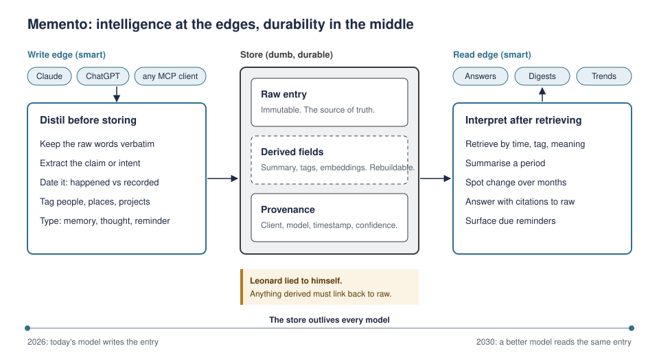

# Memento

Named after the film, where a man who can't form new memories tattoos what matters onto his body. The tattoos are permanent and dumb; interpretation happens every morning, with whatever mind he wakes up with.

Memento works the same way. You log your life from any MCP client, or by talking to a Pocket recorder. The server keeps your words exactly and permanently. The LLM you're using does the thinking: it distils what you said on the way in, and summarises, compares and spots patterns on the way out.



## Quick start

Needs [uv](https://docs.astral.sh/uv/) and Docker.

```bash
cp .env.example .env
make setup      # dependencies and git hooks
make db         # Postgres 16 in Docker
make migrate
make test
make run        # http://localhost:8000/admin
```

`make check` runs everything CI runs.

## Documentation

| Document | What's in it |
|---|---|
| [Brief](docs/brief.md) | Thesis, principles, jobs, risks and kill criteria |
| [MCP tools](docs/mcp-tools.md) | The tool surface, with descriptions exactly as shipped |
| [Build plan](docs/build-plan.md) | What's next, in order, with acceptance criteria |
| [Deploy](docs/deploy.md) | The Render blueprint, and the settings that exist because of it |
| [Decisions](docs/decisions/README.md) | Why things are the way they are |
| [Capture evals](docs/evals/capture-policy.json) | How clients should react to real messages |
| [Diagrams](docs/diagrams/) | Concept, data model, voice path, and more |

## Status

The data model, service layer and Pocket ingest are built and tested, and staging is described by [`render.yaml`](render.yaml). The MCP server and authentication are next; see the build plan.
