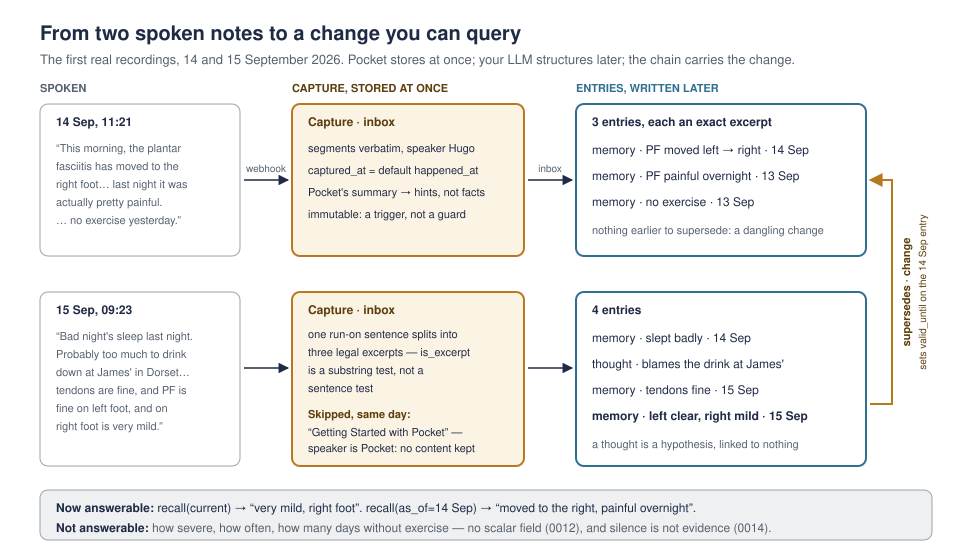

# The first real recordings

15 September 2026. The first six recordings on the Pocket account, read through
Pocket's MCP server. This is a worked example: what these notes become in the
data model, what that lets you ask, and what it doesn't. It is the raw material
for the skill's examples (M6) and for the eval cases in `docs/evals/`.

## What arrived

| Recorded | Title | Speaker | Substance |
|---|---|---|---|
| 15 Sep 09:23 | Sleep and Plantar Fasciitis Update | Hugo | Bad night's sleep, blamed on drinking at Rob's in Somerset; tendons fine, PF clear on the left, very mild on the right |
| 14 Sep 22:49 | Breathalyzer Reading and Timestamp | Hugo | "oh dot forty", taken at 23:49 |
| 14 Sep 22:14 | Breathalyzer Test Result | Hugo | "0. 41 milligrams" |
| 14 Sep 16:03 | Website Takeover Response for Priya | Hugo | Email from Priya about the website takeover from Daniel; respond tomorrow |
| 14 Sep 11:21 | Plantar Fasciitis Progress Update | Hugo | PF has moved to the right foot; painful last night; no exercise yesterday |
| 14 Sep 11:14 | Getting Started with Pocket | Pocket | The stock onboarding guide |

## A note on the quotes

Other people's names and places have been replaced with pseudonyms throughout:
the transcripts as stored are verbatim, but what is quoted here is not, so the
excerpts below would not pass `is_excerpt` against the real captures. Every other
detail — timings, structure, speaker labelling — is as recorded. The owner's own
name is kept, because the solo-voice rule turns on `PocketLink.speaker_label`
matching it.

## What this does and doesn't confirm

Read through Pocket's MCP API, not the webhook. So it confirms the shape of the
content, and nothing about ingest:

**Confirmed.** Transcript segments carry a `speaker` label, and the owner's is
their first name. Real notes are short, solo and run-on. The onboarding guide is
attributed to `Pocket`, so `_solo_verdict` skips it as "single speaker not
labelled as you yet" and `IngestLog` keeps no content: the solo-voice rule (0006)
has a real reject case on day one. The multi-speaker branch still has none.

**Still open, and unchanged by this.** The webhook payload shape, the signature
format, whether `summarizations` and `actionItems` ride along with the transcript
events, and whether `globalActionItemId` survives a regenerated summary. Those
remain M4 work against real deliveries.

## What ingest does on its own

Five `Capture` rows, `status=inbox`, `captured_at` from `createdAt`, Pocket's
summary and bullets into `hints` — another model's reading, kept apart from raw.
One `IngestLog` skip with no content.

*Since 0015, ingest ignores action items, so the next paragraph no longer holds: nothing becomes an entry until a client distils the note.*

Only the Priya note can produce an entry at ingest. If Pocket's summary carries an
action item with a `dueDate`, `_sync_reminders` writes a reminder immediately
(0007): `raw_text` is the whole transcript, `claim` is Pocket's action item
title, `client_name` is `pocket`, `external_ref` is `pocket:<globalActionItemId>`.
A date-only "tomorrow" becomes midnight in the owner's time zone, which is the
right edge for a morning sweep.

Everything else waits for a client. Today the inbox is the entire product.

## What the distiller should write

### 14 Sep 11:21 — plantar fasciitis

| kind | raw_text (exact excerpt) | claim | happened_at |
|---|---|---|---|
| memory | This morning, the plantar fasciitis has moved to the right foot. | Plantar fasciitis moved from the left foot to the right. | 14 Sep 11:21, exact |
| memory | last night it was actually pretty painful | Plantar fasciitis was painful overnight. | 13 Sep, day |
| memory | no exercise yesterday | Did no exercise. | 13 Sep, day |

The first entry is itself a change, against a left-foot state that predates the
device. There is nothing to supersede, so it stands alone. Expect this for the
first few weeks of any memory store: changes with dangling ends.

### 15 Sep 09:23 — sleep and feet

| kind | raw_text (exact excerpt) | claim | happened_at |
|---|---|---|---|
| memory | Bad night's sleep last night. | Slept badly. | 14 Sep, day |
| thought | Probably too much to drink down at Rob's in Somerset. | Puts the bad night's sleep down to drinking at Rob's in Somerset. | 14 Sep, day |
| memory | tendons are fine | Tendons were fine. | 15 Sep 09:23, exact |
| memory | PF is fine on left foot, and on right foot is very mild | Plantar fasciitis has cleared on the left foot and is very mild on the right. | 15 Sep 09:23, exact |

The last one supersedes the 14 Sep entry with `supersede_reason=change`, and
`_close_validity` stamps `valid_until` on it. That is the whole point of the
model: `recall(view="current")` now says "very mild, right foot", and
`recall(as_of="2026-09-14")` still says "moved to the right, painful overnight".

Note that "tendons are fine, and PF is fine on left foot, and on right foot is
very mild" splits into three legal excerpts: `is_excerpt` is a whitespace-squashed
substring test, not a sentence test, so sub-clauses of run-on speech are fine.

### 14 Sep 16:03 — Priya

A memory ("Email from Priya about the, um, website takeover from Daniel",
tagged `person:priya`, `person:daniel`, `project:website`), plus the reminder
Pocket already made. `docs/mcp-tools.md` tells the client to supersede that
reminder's claim rather than recreate it. See the defect below before doing so.

### 14 Sep 22:14 and 22:49 — breathalyser

Two memories. The transcriber rendered the same measurement two ways —
"0. 41 milligrams" and "oh dot forty" — and raw keeps both, so all normalisation
lives in whichever model wrote the claim. They are not duplicates:
`_find_duplicate` matches on identical squashed `raw_text`, and these differ.

## Six things this surfaced

**1. Nothing tells the distiller what to supersede.** `inbox` hands over the
transcript, the hints, and the entries made from *that capture* — never "you
already have a plantar fasciitis entry from yesterday". If the client doesn't
think to `recall` first, the 15 Sep observation lands as a second standing entry
and `view=current` returns two contradictory facts. The chain that makes Memento
worth having depends on a step nothing prompts. ADR 0014.

**2. Completing in Pocket completed the wrong entry.** Fixed, and later made moot by 0015, which drops action items altogether. Once a client
supersedes Pocket's reminder, the `external_ref` stays on the superseded row — the
`remember` tool doesn't expose `external_ref`, so the replacement has none. When the
action item was ticked off in Pocket, `_sync_reminders` looked it up by
`external_ref`, found the dead row and completed that; the live reminder stayed open
and would have fired in the morning email indefinitely. `due_reminders` already
filtered `superseded_by__isnull=True`, so the dead row never fired — only the
completion path was wrong. `services.current_version()` now walks the chain to its
head, and `_sync_reminders` completes that, or nothing at all when a memory has
replaced the reminder ("I've already done it" need not arrive as a reminder).

**3. Split granularity is close to a one-way door.** `supersedes` is a
`OneToOneField`, and `remember` refuses to supersede an entry that already has a
successor. So an entry can be updated exactly once, by exactly one entry. Split
"PF fine on left, very mild on right" into two entries and neither can cleanly
supersede the single 14 Sep entry. The capture policy pushes towards fine splitting
("one entry per observation"); the chain pushes towards writing as one unit whatever
will later be updated as one unit. The distiller cannot know which is which in
advance. Worth explicit examples in the skill.

**4. Numbers, as predicted by 0012.** 0.41 and 0.40 are prose in `claim`; so are
sleep quality and pain severity. "Is the PF trending better" is an LLM re-reading
rows, which is fine at five entries and impossible at five thousand — `timeline`
counts entries per tag, never values. These readings are the first real evidence
for 0012's day-30 review. Nothing to change yet.

**5. Time zones, exactly where 0013 expects them.** The 22:49 note says the
reading was taken at "twenty-three forty-nine": the spoken time is local, the
recording time is UTC, and they describe the same instant. A client that lets
`happened_at` default from `captured_at` is right; one that writes it from the
transcribed words is an hour out. `PocketLink.timezone` is read only by `_due_at`
today. M3 moves it to a per-user profile and puts `now` in every tool result;
`inbox` should also show each capture's local time.

**6. Tightening a claim is neither a correction nor a change.** Replacing Pocket's
"Website takeover response for Priya" with the owner's own words doesn't mean the
old claim was never true (0009's `correction`) or that the world moved on
(`change`). Today it has to be labelled `correction`, which also hides Pocket's
original from `view="history"`. Defensible — it was never the owner's claim — but
it is an abuse of the definition, and the skill should say which to use.

**Not a gap, but worth naming:** "Probably too much to drink" is a causal
hypothesis about the sleep entry, and the only links between entries are
`supersedes` and `Citation`. It lands as an unconnected `thought`. Given the
nine-tool ceiling that is the right trade, but it should be a stated non-goal
rather than something rediscovered as a bug.

## Open question for M4

Pocket ships an MCP server with a recency mode that returns full transcripts with
speaker labels and pagination — the same content the webhook would push. A pull
loop would sidestep signature verification, replay windows and the four unknowns
above, at the cost of latency and of idempotency resting on polling state rather
than on a unique key. Push remains the plan (0006); this is worth ten minutes of
thought at M4 rather than a silent default.
